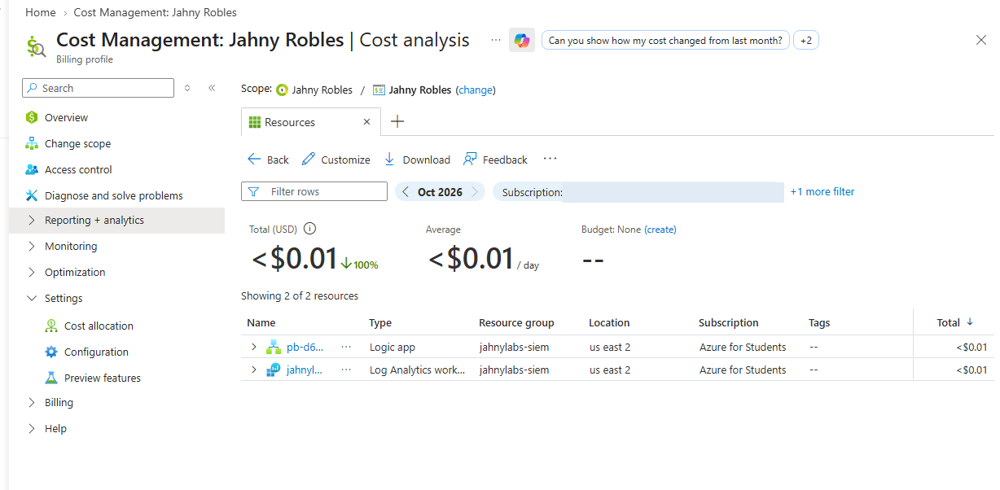
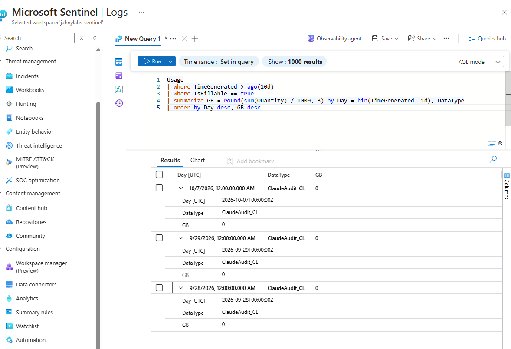
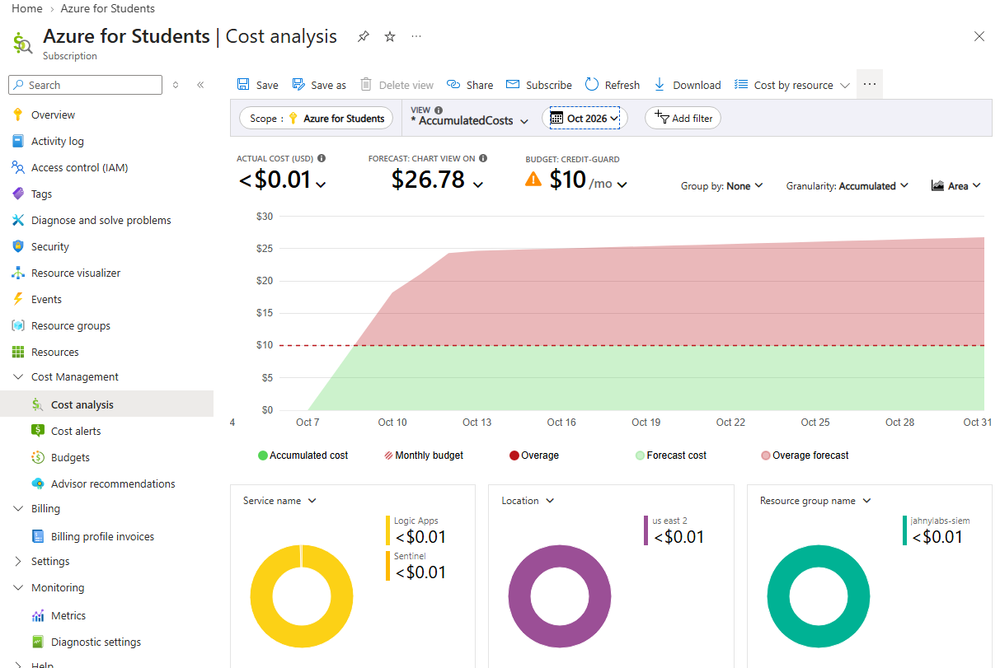
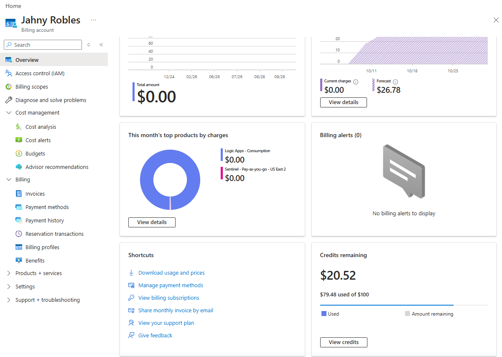

# Runbook: responding to a cloud cost alert

A worked example from this lab. A budget alert said the month would cost three times the budget. The right response
was to **check before acting**, and the checks showed there was nothing to fix. This page records the order of those
checks so the next alert, real or not, gets the same calm, evidence-first treatment.

Why this belongs in a SOC portfolio: in Microsoft Sentinel the bill is driven by how much data you ingest. A cost alert
is an operational signal about your logging pipeline, the same family of problem as the heartbeat rule H1 (see the
[NIST write-up](nist-csf-write-up.md)). Analysts who panic and delete the workspace lose their detections. Analysts who
ignore every alert miss the real one.

---

## The alert

| Field | Value |
|---|---|
| Budget | `credit-guard`, $10.00 per month, started 1 Oct 2026 (set up in [screenshot 45](../screenshots/45-budget-credit-guard.png)) |
| Alert type | **Forecast** threshold ($8.00 = 80% of budget) |
| What it said | "Forecasted to reach **$32.03** before the end of the period" |
| When | 8 Oct 2026, 18:08 UTC (day 8 of the month) |
| Credit left at the time | about $20.52 of $100 (Azure for Students) |

First read of the numbers: $32.03 over 31 days is about $1/day, so the remaining credit would last about 20 days, and when
it runs out the student subscription disables itself, taking the lab with it. That is worth taking seriously until
it is checked. It is **not** worth acting on until it is checked.

---

## The response, in order

The rule behind the order: **start with what is cheapest to look at and most likely to settle the question, and do
nothing irreversible until the evidence says so.**

### 1. Is it actual spend or a forecast?

Read the alert type. A *forecast* alert is a prediction. An *actual* alert is money already spent. They need different urgency.
Forecasts made in the first days of a month, or right after a usage pattern changed, are noisy: they extrapolate from
recent history, and cost data posts 24 to 48 hours late.

### 2. What has actually been spent this month?

Cost Management → Cost analysis → scope your subscription (or billing profile) → this month.

**Result:** total **under $0.01** for October, only two resources listed (the Logic App playbook and the Log Analytics workspace), both under a cent.



Two things on this screen look odd and are normal:
- "Budget: None" appears because this view is at billing-profile scope. The budget lives on the subscription, and its alert email arrived, so it works.
- The subscription ID chip is blurred in the screenshot.

### 3. Is the thing that drives the cost happening right now?

For Sentinel the driver is billable ingestion. Query it directly instead of inferring it from the bill:

```kusto
Usage
| where TimeGenerated > ago(10d)
| where IsBillable == true
| summarize GB = round(sum(Quantity) / 1000, 3) by Day = bin(TimeGenerated, 1d), DataType
| order by Day desc, GB desc
```

**Result:** the only billable table in 10 days is `ClaudeAudit_CL`, at 0 GB (under 0.0005 GB per day). No `Event` or
`SecurityEvent` rows, which means the earlier Windows-log collection really is off.



### 4. Decide, using a table written before the alert arrived

| Evidence | Meaning | Action |
|---|---|---|
| Actual spend is small **and** current ingestion is near zero | The forecast is an artifact | Do nothing destructive. Recheck cost tomorrow. |
| Actual spend is climbing day over day | Real leak | Find the meter (Cost analysis, group by Meter then Resource) and stop that source |
| A table such as `Event` or `SecurityEvent` is arriving daily | A data source is still on | Disable the collection (data connector or DCR association) rather than deleting the workspace |
| Ingestion sits at the daily cap every day | The cap itself is the cost | Lower the cap, and give the noisy source its own workspace |
| A non-Sentinel resource dominates (VM, public IP, disk) | A forgotten resource | Deallocate or delete that one resource |

**This alert landed in the first row.**

### 5. Write down what would change the decision, and when you will look again

- Recheck **tomorrow**: Cost analysis → subscription → Oct 1 to today → **Accumulated costs**.
- If accumulated cost is still under about $1 while the forecast stays above budget, the forecast is wrong. Consider moving the forecast alert threshold, not the budget.
- If accumulated cost jumps, repeat steps 3 and 4 with that day's data.

**Recheck result (9 Oct, about 19 hours after the alert):**

| Signal | 8 Oct (alert) | 9 Oct (recheck) |
|---|---|---|
| Actual October cost | under $0.01 | **still under $0.01** (Logic Apps and Sentinel each under a cent) |
| Forecast | $32.03 | $26.78 |
| Credits remaining | $20.52 | **$20.52** (unchanged) |
| Billing account "current charges" | | $0.00 |





**Conclusion: the forecast was an artifact.** Spend did not move, the credit balance did not move, and the forecast itself changed by about $5 in a day
without any change in real usage, which is the sign of a projection and not a measurement. No action was needed on the resources.

**What the signal that matters looks like:** *credits remaining* is the cleanest check here, because it only changes when money is actually consumed.
Watch it, not the forecast. If it starts to drop, go back to steps 3 and 4.

**Optional tuning so the alert stops crying wolf:** Budgets -> `credit-guard` -> edit alert conditions. Keep the **actual** alerts (50% and 80%) and either
remove the forecast alert or raise its threshold well above 100%. A forecast alert is useful on a stable workload and noisy on a lab that just
changed its ingestion pattern.

---

## What not to do

- **Do not delete the workspace or the Sentinel solution** to "stop the bill". Every detection (D1-D6, H1), the workbook and the playbook depend on it. Disabling a data source is reversible; deleting is not.
- **Do not lower the daily cap as a reflex.** The cap is workspace-wide. When it is reached, *every* table stops ingesting until the reset (19:00 UTC here), including `ClaudeAudit_CL`, so a tight cap can blind the very detections the bill is paying for.
- **Do not act on the dollar figure in the email alone.** The email shows the forecast and nothing about its cause.
- **Do not paste the alert email into a repo or ticket as-is.** It carries the billing account ID, tenant ID and your contact email. This page quotes only the budget numbers.

## A note on my own first reaction

My first assessment treated the forecast as real and suggested that the 0.1 GB/day cap might itself be costing roughly
$15-22 per month if hit every day (an estimate using about $5-7 per GB for Sentinel plus Log Analytics ingestion; check current pricing).
The arithmetic is plausible, but it was a hypothesis about a bill nobody had looked at. The two checks above took about
five minutes and showed ingestion was near zero, so the hypothesis did not apply. The habit worth keeping: **measure first, then reason about causes.**

## Controls that made this response easy

| Control | Why it helped |
|---|---|
| Budget at subscription scope with forecast **and** actual-percent alerts | Caught the signal on day 8 instead of at month end |
| `Usage` table queryable in Logs | Gave a direct answer about ingestion without waiting on billing data |
| One resource group (`jahnylabs-siem`) for the lab | Cost analysis listed only two resources, so nothing could hide |
| Earlier cost investigation (see the README cost section) | Already knew which tables had caused the September spend and what "normal" looks like now |

## Reusable checklist

1. Alert type: forecast or actual?
2. Actual spend this month, grouped by resource.
3. Current billable ingestion by table (the query above).
4. Match to the decision table; take the least destructive action that fits.
5. Record the evidence (screenshots, numbers) and a recheck time.
6. If nothing is wrong, say so and adjust the alert so it stops crying wolf. If something is wrong, fix the source, not the symptom.
